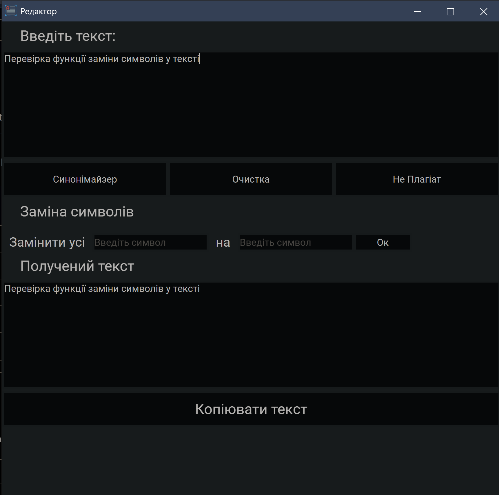

# improvement_text

Ідея программи це обробка тексту так, щоб його не замічав антиплагіат, також це очистка тексту від непотрібних символів і усе це у зручному графічному інтерфейсі

# Робота программи

1. Функція "ua_to_en" заміняє символи української мови (символи кириллиці) на її візуальні аналоги у англійській мові (латинні символи) наприклад:
"а" - українська буква а.
"a" - англійська буква а.
Якщо замінити увесь текст такими буквами то більшість антиплаіатів та програм для перевірки текстів/текстових файлів будуть видавати мінімальні результати.
2. Функція "replace_sybmols" заміняє введенй символ на інший введений символ у тексті, досить зручна функція для роботи із текстом.
3. Функція "clear_text" очищає даний текст від непотрібних символів наприклад ([^)]*)
4. Функція "synonymizer" проводить текст через синонімайзер на сайті https://rustxt.ru/synonymizer та повертає текст із синонімами (Примітка функцію "synonymizer" потрібно використовувати до функцї "ua_to_en")

# Інтерфейс


## Перевірка роботи функції "ua_to_en"

```python
a1 = "Перевірка функції заміни символів у тексті"
a2 = "Пepeвipкa фyнкцiї зaмiни cимвoлiв y тeкcтi"
print(a1 == a2)
```
>False